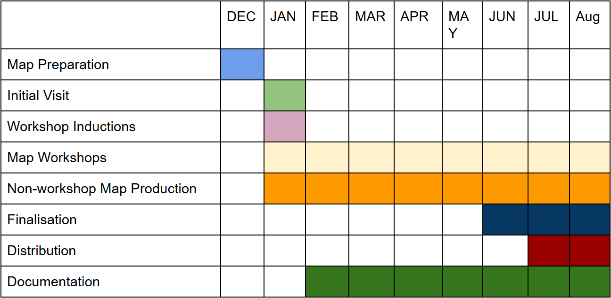

# Welcome to Glasgow Children Hospital Minecraft
## Introduction

This project was initiated by Ginkgo Projects alongside Glasgow Children’s Hospital Charity who also funded the project in partnership with Trefoil House. Production and management was handled by [Hadi Mehrpouya](http://hadi.link) of Abertay University and Chris Barker.

The work conducted here was informed by a feasibility study written in 2016 which investigated what might be an effective and useful way to collaborate with Hospital patients to make an interactive digital version of the buildings.

## Purpose
The purpose of the project is to counteract the negative experiences faced by children and young people who attend the Royal Hospital for Children in Glasgow frequently, or for long periods of time. These young people have often had to relinquish a lot of control over their own lives due to their challenging clinical needs. Giving patients the opportunity to create the hospital grounds in a virtual environment will be particularly beneficial for young people in isolation or unable to leave their wards, allowing them to explore and create directly from their bedside. By engaging the children more in their surroundings, we are adding to the active and therapeutic campus environment, encouraging the young people’s imagination and proactive play.

## Team

The project was lead and coordinated by Hadi Mehrpouya and Chris Barker, as stated in the Introduction.

Students from Abertay University were enlisted to increase the frequency with which the workshops in the hospital could be conducted. The two people selected were Nikita Kotter and Bettina Georgieva, both of whom being students under Hadi Mehrpouya.

Later in the project Edinburgh artist Robert Powell was brought in to assist in the production of a promotional video.

## Map preparation
Prior to the workshop phase some basic structure was produced on the PC version of minecraft by HM and CB. This process involved using reference photos and satellite imagery to assess the shape and scale of the children?s hospital. Foundations were then drawn out onto a blank Minecraft map at an approximate scale of 1 block = 0.5 metres.

The aim of this phase was to avoid having the patients spend too much time considering architectural minutia and instead to have them creating sections of the model from what they had seen or what they could imagine an improved version of the building to be like.

## Production Phase
Production consisted of numerous visits in person to the hospital to conduct workshops. Each session was approximately 2.5 hrs, divided between typically 2-3 patients. Workshop facilitators would collaborate with the patient to produce a small part of the hospital map. This might be a room (particularly their own) or a large piece of furnishing like a pond or play area. The focus of the workshops was always to have them lead creatively by the patient. The facilitator was in place to assist where needed and to suggest what Minecraft blocks might work best to realise the ambitions of the patient.

Following a visit the map file was backed up and shared with the project team via Dropbox. Where possible a facilitator would spend the remainder of their day cleaning-up or making improvements to the part of the hospital that had been built in their workshop. Screenshots and camera photos of the screen during play were shared similarly.

## Consolidation
Between the main run of workshops and the distribution of the map to the hospital consoles, some time was invested in filling any gaps in the overall structure of the hospital building model. Particularly this was in making sure that all floors extended through most of the model and that there was roofing and internal lighting through the majority of the footprint.

## Deployment Phase
In this phase the map file was converted from the PC version of the game to work on console editions which read the data slightly differently. Fortunately this is quite a well-established process in Minecraft, with a number of tools available for the task. The basic process in each case can be expressed thus:

Take Glasgow Hospital model save file and a blank save file from the console of choice (Playstation, Xbox)
Extract the raw geometry data from the PC file and replace the contents of the console file.
Reseal the console save file.
Copy that file onto all the other Xboxes or Playstations

For a visual documentation of how to deploy the model on Xbox or Playstation please refer to [Guide to download and deploy the model](download.html) section .

One issue that we experienced in this phase was the compatibility of certain blocks between our fairly recent version of the Minecraft game on PC and the outdated version that comes as standard on retail boxed console editions. On opening the newly populated save files, the console would simply crash or show nothing.

To solve this issue we needed to manually apply updates to the game consoles in the hospital wards, which brought support for newer types of blocks that had been used by patients in designing the ingame Hospital.
This can be done via the internet or thwe dedicate flash memory that has been given to Ally member of staff at Zone 12.

## Participatory approach
Over the past twelve months, the project was developed in two phases.
1. Feasibility Phase
2. Production and Deployment
### 1. Feasibility Phase
The purpose of this phase was to run several participatory workshops with hospital patients to work out what areas of hospital are more important to them as well as how they want to represent it in minecraft. In addition we gain more insights about the challenges and opportunities of working within a hospital context.
Our first workshop took place on 22nd of June 2016, followed by second visit on 21st July 2016 and last one on 2nd August 2016. Each workshop consisted of participatory methods to find out about various ways and imaginations that patients have in terms of looking at the hospital setting from different perspectives.
At the end of this phase, a report was delivered which can be accessed [here](public/res/Minecraft_Feasibility_Report.pdf)

This report was commissioned by Glasgow Children’s Hospital Charity via Ginkgo Projects to assess the viability of building and running a version of the hospital space in the multi-platform video game Minecraft. The report has been written and developed by Chris Barker and Hadi Mehrpouya. Within this report, ‘we’ means the workshop leaders and report authors i.e. Chris Barker and Hadi Mehrpouya.

In order to realise some of the challenges, opportunities and concerns in regards to Minecraft work, three visits were made to the hospital. Workshops and interviews were used as the method of inquiry. Of these workshops, patients were directly involved in two. All patient names are anonymised.

Glasgow Royal Hospital for Sick Children (GHSC) consists of a total of 4 wards, with 11 separate sub-wards. Each floor is equipped with game consoles, both mobile and in each playroom. Each patient room is also equipped with an entertainment system which provides access to internet, some games, and streaming websites such as Netflix.

### 2. Production and Deployment

Phase 2 of this project was focused on developing a model of the hospital in minecraft through a participatory approach. This was done through a series of workshops that took place between Jan - Aug 2017. The usual structure of the workshops is as follows:
1. Member of the team would visit the hospital
2. Depending on who would be able to contribute and work with us, Zone 12 staff would make a list of 3-4 patients to work with
3. Meet the patients and if they are not familiar with minecraft give them a quick introduction
4. Patients can go with hospital staff and member of our team to take some visuals of which part of the hospital they want to develop
5. return to their room/zone12 work on the model until they are tired or not engaging anymore
6. Backup the model on dropbox

This process was being repeated for the other patients on that day. between the workshop sessions members of the team would spend sometime to polish and develop the unfinished work.

Overall we have worked with over 50 patients with several repetitions.

## Deliverables
The initial agreement for deliverables was limited to the Minecraft Map itself - distributed on as many hospital devices as possible - along with this report.
Capacity was built into the budget for unspecified promotion and documentation of the project:
As part of this aim, the project commissioned and Edinburgh based artist Robert Powell to:
- make a 3D sculpture outside the hospital in minecraft
- Printed picture and visual of the model for publicity inside the hospital. We are envisaging this to be placed inside zone 12
- Promotional video documenting and presenting the efforts and the outcomes

## Acknowledgements
Thank you to **Sarah Barr** and **Ally Mellon** at the Royal Hospital for Children, Glasgow. Their help in facilitating and supervising workshop visits was essential to the success of the project.
It was clear to see that their hard work and enthusiasm was a hugely positive influence on quality of patient care and wellbeing.

Further thanks to **Chris Fremantle**, **Tom Littlewood**, and **Julie** from Ginkgo Projects; and **Hannah Kerrigan** from Glasgow Children Hospital Charity, for all their support to project. Further thanks to Glasgow Children’s Hospital Charity and Trefoil House for generously funding GCH Minecraft.

Finally many thanks to Robert Powell for his great contribution and work on the video documentation, minecraft sculpture and printed version of the model. Nikita Kotter for his commitment and hard work throughout the project not only as workshop facilitator but on many other fronts.

