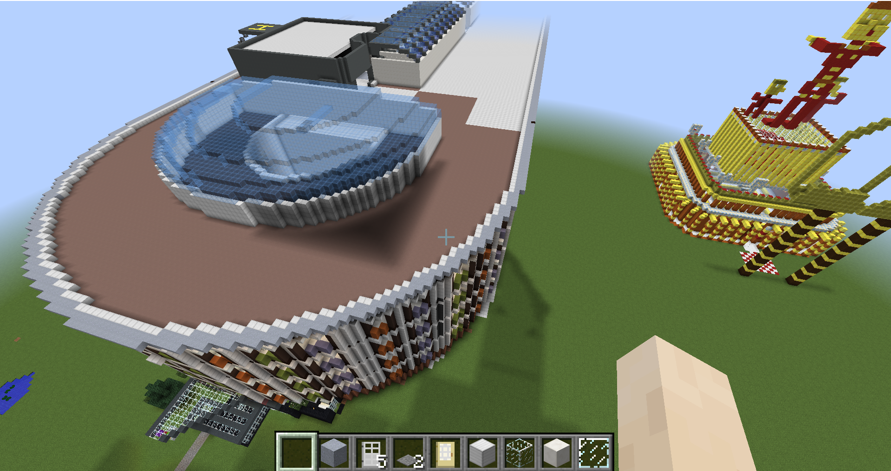
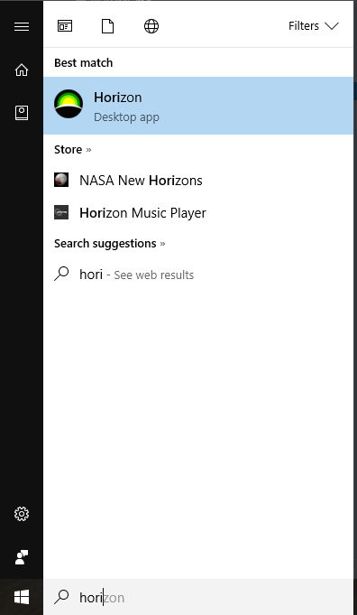
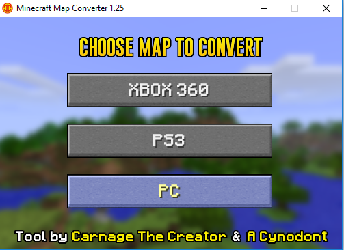
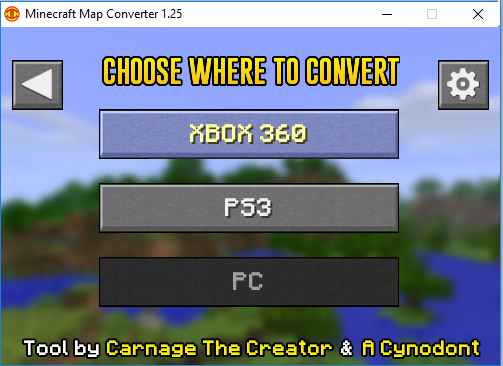
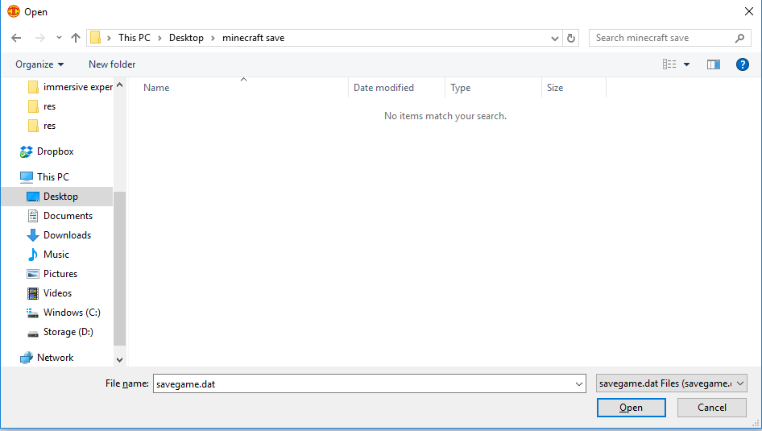

This guide will show you how to download the model and install it on your PC (Windows only) or game consoles.
The process can be broken down to the following. further within this document each process will be explained further.

# How to copy the model on PC
In order to access the Hospital model in minecraft on your PC, you need to follow step **1** and **2** from the Xbox deployment instructions below.

You will need to copy the contents of the extracted model into your minecraft saves folder. On Windows machines this is usually located at
C:\Users\<YOUR USERNAME>\AppData\Roaming\.minecraft\saves

# How to deploy the model for Xbox

## Summary of steps

1. Make sure you have all the deployment softwares installed on your PC
2. Download a copy of the model from [here](https://github.com/Mehrpouya/gch_minecraft/raw/master/RHC_Final.zip)
3. Make a minecraft save on a portable memory (flash memory)
4. Export the save date
5. Convert the model into Xbox/Playsation
6. Replace the Xbox/Playstation save with the new save contents
7. Copy the new save into your game console

## 1. Software requirements
In order to deploy the model into your console you need to have Horizon and Minecraft Map converter installed on your PC.
### 1.1. How to install Horizon

Horizon is a tool that modifies files saved to the Xbox 360's memory. It enables you upload and download game saved files. to do things that would either take a long time or do things that aren't even available normally. Increase your gamerscore, unlock all your avatar awards, unlock in game items, get on top of leaderboards, get infinite health, change an avatar's colors, the possibilities are endless!

You can download the latest version of horizon [here](https://horizon.soft32.com/)
Once you have horizon installed, go ahead and install Minecraft Map Converter

### 1.2. How to install Minecraft Map Converter
This tool was created to allow Minecrafters from various communities to come together and share their maps with each other. With the Minecraft map converter tool, you can  quickly and easily transfer maps between Minecraft PC, Minecraft Xbox 360, and Minecraft PS3!

You can download the latest version of horizon [here](http://minecraftmapconverter.com/)

## 2. Downloding the model
Compressed(zip) version of the Glasgow Children Hospital Minecraft model can be downloaded via the following [link](https://github.com/Mehrpouya/gch_minecraft/raw/master/RHC_Final.zip).

Once you have downloaded the model, you need to have a software to extract the compressed model.

### 2.1. How to extract the model
Use a decompression software to extract the model files from the downloaded file.

This can be done by using [7-zip](http://www.7-zip.org/download.html) or [winzip](http://www.winzip.com/win/en/downwz.html)

Make sure you extract the files into the minecraft save folder on your PC.

## 3. How to make a save on a portable memory (memory stick)
In order to copy the model into Xbox, you need to make a sample save from inside the game by the console you are planning to deploy the model to.
This can be done in two ways:
**3.1*. *Goto games and apps, then find minecraft. The save files are there. You can go down the list 1 by 1 and click on a save file, select copy and then after window pops up, select the flash drive you are trying to save to.

And that is all. If you want to do the reverse then goto the flash drive first then games and apps, find minecraft, and the save files should be there.

To save within the game directly to that drive (not advisable) you would have to select flash drive from minecraft boot up. This only works for new game

## 4. Export the saved data
Make sure you have plugged the flash memory that you have the minecraft save onto your PC.
In order to export the save data, we need to use horizon. Go ahead and open horizon on your PC.

It will take a short while for horizon to load. Once horizon is open.

1. Click on device explorer on the right hand side of the screen.
2. Go to the USB that you've just made a fresh save on.
3. Go to minecraft folder
4. Drag and drop the minecraft save into the middle of this screen.
5. Go to content tab on the new screen that you just opened in Horizon
6. Right click on the SaveGame.sav and hit Extract. Save the file to a location on your computer where you can easily find it again.

Great now you have the save file ready to modify and and replace it with the hospital model.

## 5. Convert the model for Xbox/Playsation
In order to convert the model for Xbox/Playstation we will use the Minecraft Map Convertor that you have installed in step 1 of this tutorial.
Go ahead and open the **Minecraft Map Converter**

You are going to convert from PC to Xbox so first click on PC

Next click on Xbox as we are converting the model for Xbox

The program will now ask you to tell it where to save the new model. point this to the save file you made in previous step.

Click open, it will take a file and finally end with a success message.

**You are almost there!**

## 6. Replace the Xbox/Playstation save with the new save contents
Now you need to replace the save file in your flash memory.

For this step you will need horizon again.
As instructed previously go ahead and load the save folder from your flash memory into minecraft.

1. Click on device explorer on the right hand side of the screen.
2. Go to the USB that you've just made a fresh save on.
3. Go to minecraft folder
4. Drag and drop the minecraft save into the middle of this screen.
5. Go to content tab on the new screen that you just opened in Horizon

This time instead of clicking on export, rifht click on the save and click on replace.
point it to the location you've just saved the savegame.dat with map coverter.
Once it gives you the success message. you need to hash and sign it.

## 7. Copy the new save into your game console

now unplug your flash memory from your PC and plug it into your Xbox
You now have the model ready for your console.
All you need to do is to copy the model into your Xbox.
This can be done by:
- going into your console setting
- finding the flash memory and minecraft save.
- move it into your local minecraft saves and you'er done!

Next time you load minecraft you should be able to see the model. Note that due to minecraft saving mechanism, the model can only be used by the user profile that you logged into your Xbox.
